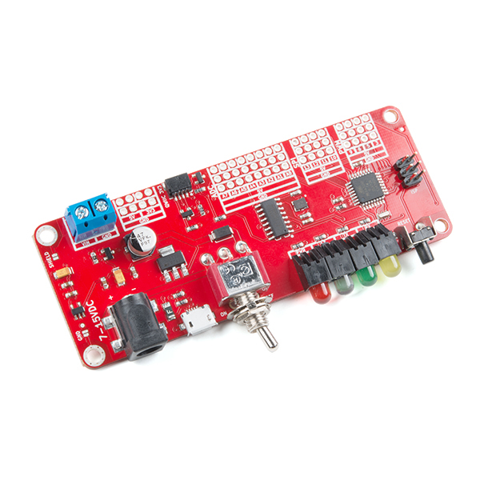

# The current ecosystem

The QWIIC system is an I2C connection standard, developed by [Sparkfun](www.sparkfun.com) and open to everybody as long as the standard guidelines are followed.

## The standard guidelines

1. You have to use JSP connectors
2. You have to use the Pinout[0:3] = 5V, SCA, SCK, GND
3. You have to use Qwiic color coding on cables:
   - **Yellow** = SCL
   - **Blue** = SDA
   - **Red**    = 3.3V
   - **Black**  = GND
3. You should limit the power to 226mA

## List of know modules

### List of MCU boards with built-in connectors

| See it                            | Module                                                | Price  | Manufacturer | Buy Online                                               |
| --------------------------------- | ----------------------------------------------------- | ------ | ------------ | -------------------------------------------------------- |
|  | SparkFun RedBoard Edge (ATMEGA328, Front mountable)   | $18.66 | SparkFun     | [SparkFun Shop](https://www.sparkfun.com/products/14525) |
|                                   | SparkFun RedBoard Turbo (SAMD21, Arduino UNO headers) |        | SparkFun     |                                                          |

### List of MCU board shields, hats, etc.

| Target board                                | Manufacturer | Price | Buy Online                                                   |
| ------------------------------------------- | ------------ | ----- | ------------------------------------------------------------ |
| Raspberry Pi (HAT)                          | SparkFun     | $5.95 | [Sparkfun Shop](https://www.sparkfun.com/products/14459)     |
| Arduino UNO (Shield)                        | SparkFun     |       |                                                              |
| Photon (Shield)                             | SparkFun     |       |                                                              |
| Adafruit Feather (Wing)                     | Steiert      |       | [CrowedSupply](https://www.crowdsupply.com/steiert-solutions/qwiikit) |
| [mikroBUS](https://www.mikroe.com/mikrobus) | Steiert      |       | [CrowedSupply](https://www.crowdsupply.com/steiert-solutions/qwiikit) |

### List of outputs

| Module | Manufacturer | Buy Online |
| ------ | ------------ | ------------ |
| xxx    | xxx          | xxx          |

### List of inputs

| Module                         | Manufacturer | Price | Buy Online                                |
| ------------------------------ | ------------ | ----- | ----------------------------------------- |
| Qwiic Keypad - 12 Button       | SparkFun     | $8.46 | <https://www.sparkfun.com/products/15290> |
| Qwiic Rotary Encoder & REB-LED |              |       | <https://www.sparkfun.com/products/15083> |
| SparkFun Qwiic Joystick        |              |       | <https://www.sparkfun.com/products/15168> |

### List of sensors

| Module                                          | Manufacturer      | Buy Online                                     |
| ----------------------------------------------- | ----------------- | ---------------------------------------------- |
| Zio Current and Voltage Sensor - INA219 (Qwiic) | xxx               | <https://www.sparkfun.com/products/15176>      |
|                                                 | Smart-Prototyping | <https://www.smart-prototyping.com/Qwiic.html> |

### List of acutators

| Module           | Manufacturer     | Buy Online                                                   |
| ---------------- | ---------------- | ------------------------------------------------------------ |
| Servo Controller | Smart-Protoyping | <https://www.smart-prototyping.com/Zio-16-Servo-Controller.html?search=zio> |

### List of cables

| Module                           | Manufacturer | Buy Online                                             |
| -------------------------------- | ------------ | ------------------------------------------------------ |
| Cable 15cm - Breadboard to Qwiic | Adafruit     | [Adafruit Shop](https://www.adafruit.com/product/4209) |
| Cable 10cm - Qwiic to Qwiic      | Adafruit     | [Adafruit Shop](https://www.adafruit.com/product/4210) |
| Grove to Qwiic                   | SparkFun     |                                                        |

### List of plugs

| Module                                | Manufacturer | Buy Online                                                   |
| ------------------------------------- | ------------ | ------------------------------------------------------------ |
| Connector - Right Angle SMD (10-pack) | Adafruit     | [Adafruit Shop](https://www.adafruit.com/product/4208)       |
|                                       |              | <https://www.digikey.com/catalog/en/partgroup/sparkfun-qwiic-adapter/75247> |

## List of known sets

